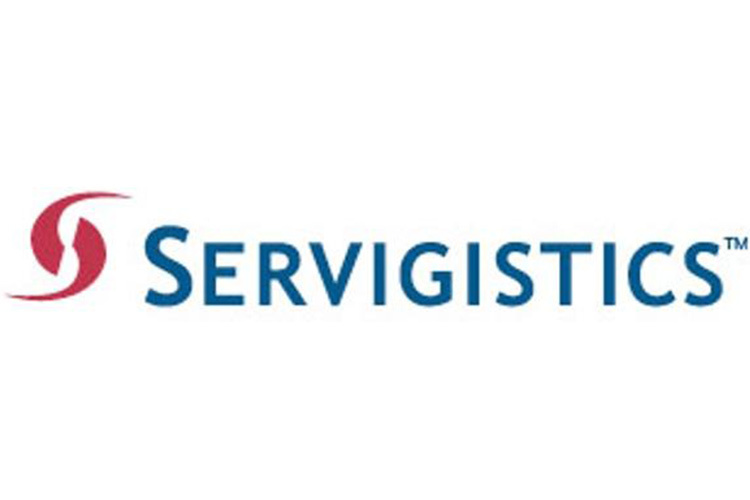

Before the Research, the Past Work

More than a decade in enterprise software — chasing down missing data in client warehouses, shipping product roadmaps, and learning what the textbooks leave out.

---

## Intro

I came to academic research the long way around. Before I ever set foot in a PhD program, I spent over a decade working in operations at global companies — first as a consultant and solution manager, deploying supply chain software from i2 Technologies, then as Director of Product Management at Servigistics, building the planning solutions that facilitate aftermarket service operations.

This page is an attempt to connect my career dots, not a résumé entry, and to reflect why my research interests goes beyond my academic curiosity. It captures some technical challenges, industry debates, and moments where theory and practice collided.

---

## i2 Technologies

Now Blue Yonder · Dallas, TX & Tokyo, Japan
Consultant & Solution Manager

### How I Got There

I joined i2 Technologies when the company was riding the first wave of enterprise supply chain software — before SaaS, before cloud, before the term "digital transformation" existed. i2 was building tools that promised something genuinely new: let large manufacturers see through their supply chains, synchronize demand with supply, and make better decisions faster. The ambition was enormous. So were the implementation challenges.

> "The software worked beautifully in the demo. The real world had other ideas."

### What the Work Actually Looked Like

My job was to sell and deploy supply chain planning systems at Fortune 500 clients across North America and Asia-Pacific. In practice, this meant spending weeks embedded inside client operations — walking factory floors, sitting with demand planners or production schedulers, tracing the lineage of a single data field through several legacy systems to figure out why the forecast numbers or inventory records didn't match reality.

Every implementation was a renegotiation between what the software assumed and what the client's operations actually looked like (We call it business process re-engineering nowaday). Demand signals are contaminated by promotions, returns, and internal orders. Lead times weren't fixed, they depends on how your suppliers' prioritize you. Inventory policies have been set years ago and never revisited. The mathematical models in the system were always cleaner than the world they were supposed to represent.

One project I worked on at a large Japanese printer manufacturer illustrated this perfectly. The install base data — the foundation of any good service parts forecast — was contaminated at the source: units shipped to a distributor in Singapore were turning up in Eastern Europe, ordering spare parts from Singapore because that's where the regional contract was, generating a cascade of mismatched demand signals across every downstream planning system. The formula was simple. Getting clean inputs never was.

### The Tactical vs. Strategic Divide

One of the lessons I internalized early — and have written about at length — is the difference between tactical and strategic planning in supply chain contexts. It sounds obvious until you sit in a client meeting where a VP is demanding a single system that does both. Tactical planning optimizes operations within a given capacity. Strategic planning asks what that capacity should be in the future. The planning horizon, the data granularity, and the organizational accountability — all differ. You need them to talk to each other, but you cannot collapse them into one.

The best implementation I ever saw of this separation was at a major Taiwanese semiconductor foundry. Their strategic module was run by operations researchers reporting to the head of Finance — independent, analytically serious, with real organizational teeth. Other clients, where the distinction was less clear, paid the price in various ways.

### Tokyo and the Asia-Pacific Years

Part of my time at i2 was based in Tokyo, working with Japanese manufacturers and distributors. Working across language and cultural boundaries added another layer to an already complex job. In Japan, the relationship between client and vendor carried different expectations — the implementation was as much a trust-building exercise as a technical one. You didn't just configure a system; you became part of the client's planning team for the duration of the project.

Those years shaped how I think about information asymmetry and incentive alignment in supply chains — topics that would later appear in my research. When a client's planning team doesn't fully share operational data with their software vendor and papers over problems to make the project look on track, the downstream consequences can take months to surface. I watched it happen more than once.

### What I Took Away

Supply chain theory says: minimize costs subject to service-level constraints, given some demand distribution and lead time. Practice says: figure out which data you can actually trust, negotiate with stakeholders who have competing incentives, and build a model that's wrong in predictable rather than unpredictable ways.

🏆 **Best Consultant Award — i2 Technologies, 2001**

**Topics:** Supply Chain Planning · Demand Forecasting · Inventory Optimization · S&OP · Enterprise Sales · Tactical vs. Strategic Planning · Asia-Pacific

---

## Servigistics

Acquired by PTC · Atlanta, GA
Director of Product Management

### Moving from Consulting to Product

After years of deploying other people's software, I wanted to sit on the other side of the table — to provide insights on what the product should do, not just how it could be implemented. I moved to Servigistics. The company built planning solutions specifically for aftermarket service organizations: part and labor availability, replenishment and logistics, and planning and pricing that keep products running after the original sale.

It's a domain that doesn't get as much attention as forward supply chains, but the operational complexity is just as high — and in many ways the stakes are higher. When a hospital's imaging equipment is malfunctioning, a service vehicle encounters a blown tire, or, needless to say, an fighter jet needs to be combat-ready, the tolerance for stockouts is effectively zero. The costs of carrying too much inventory and resources are also enormous. Service planning sits in that narrow window between the two.

### Service Parts Demand Forecasting

Most demand forecasting assumes items sell regularly enough to detect a pattern. Service parts violate that assumption constantly. A critical spare might have zero demand for several months, then a sudden spike when a fleet ages or a recall hits. The statistical methods that work well for consumer goods — moving averages, exponential smoothing, and seasonal decomposition — are often useless here.

One technique I spent considerable time on, both at Servigistics and in writing afterward, is *Croston's method* — a forecasting approach specifically designed for intermittent demand that separates the forecast of demand size from the forecast of inter-arrival time. The benefit is intuitive: rather than spreading an expected demand of 0.36 units evenly across every period, Croston tries to detect the periodicity and predict when a demand event is likely to occur. In an (s, s−1) inventory policy — common in aerospace and long-cycle service planning — this timing matters. If you know demand won't occur for the next two periods, there's no reason to push inventory into the channel now. A 747 engine idling on a shelf for a quarter has real financial consequences.

But Croston is not a cure-all. I argued consistently, based on client experience, that Croston's timing benefit fades quickly outside of low-demand, (s, s−1) environments — and that in longer-lead-time situations or higher-volume items, the added complexity can amplify the bullwhip effect rather than dampen it. The variance associated with timing errors, not just quantity errors, gets embedded in safety stock calculations and cascades upstream.

> "In service parts, the demand signal is rare, erratic, and safety-critical. You can't average your way to a good forecast — but you also can't assume Croston solves the problem."

### The Fill Rate Problem Nobody Agrees On

One of the most persistently confusing issues in service parts planning is fill rate measurement. Not because the concept is hard, but because the industry uses the same word to mean several fundamentally different things. Type 1 fill rate — also called Customer Service Level (CSL) or "no stockout rate" — asks: at any moment a customer places an order, can you fill it immediately? It's customer-centric and unforgiving: if the item isn't on the shelf at that instant, it's a miss.

Type 2 fill rate — more common in high-tech, heavy industrial, and aerospace service contexts — asks something subtler: over the planning horizon, what fraction of expected demand can be satisfied? The crucial difference is that Type 2 credits you for periods when no demand occurs at all. A part with intermittent demand that sits at 0 for six months and then has one request isn't failing six times — it's succeeding six times and then being tested once. The two metrics can diverge dramatically in low-demand service environments, and confusing them leads to either massive overstock (if you target Type 1 in a Type 2 world) or false confidence (if you report Type 2 but manage to Type 1 expectations).

I wrote about this confusion extensively because I kept running into it in client engagements — planners who couldn't articulate which type they were tracking, service contracts written in terms that were ambiguous about the measurement basis, and vendor benchmarks that cherry-picked definitions to make their performance look better. Academic treatments of this topic often didn't help, modeling one or the other without acknowledging the practical consequences of which you choose.

### Multi-Echelon Inventory Optimization

A large service organization might have parts stocked at a central depot, several regional warehouses, and hundreds of field technician vehicles — a three- or four-echelon network. The classic single-location inventory model doesn't come close to capturing this. The optimization problem involves not just how much to stock at each location, but how to balance stock across levels to minimize both cost and response time simultaneously.

The academic literature on this problem — running from Sherbrooke's METRIC model through the frameworks of Dr. Muckstadt (Cornell) — is rich and genuinely difficult.

📖 **[Analysis and Algorithms for Service Parts Supply Chains](https://www.amazon.com/Analysis-Algorithms-Operations-Financial-Engineering/dp/0387227156)** — John A. Muckstadt · Springer, 2005
The foundational text behind the multi-echelon algorithms Servigistics commercialized. Our connection with Dr. Muckstadt at Cornell gave the product team direct access to the intellectual lineage of METRIC and its successors — and a front-row seat to the ongoing debate between two of the field's defining frameworks.

For a general audience unfamiliar with MEIO, the video below offers a reasonable visual introduction to the problem structure:

<iframe src="https://www.youtube.com/embed/si8Klzl80Ww" style="position:absolute;top:0;left:0;width:100%;height:100%;border:0;" allowfullscreen loading="lazy" title="Multi-Echelon Inventory Optimization — Introduction"></iframe>

That said, the video should be taken for what it is — a pleasant, high-level overview, not a serious treatment of the problem. It conveys the intuition that decentralized safety stock decisions produce suboptimal system-wide outcomes, and that coordinating across echelons can reduce total inventory cost. Beyond that, it offers little analytical substance.

**MEIO is fundamentally a difficult non-linear optimization problem.** Safety stock decisions interact across echelons in non-linear ways: the demand variance seen at an upstream node depends on ordering behavior downstream, which in turn depends on service level targets, lead time distributions, and demand patterns that are rarely stationary. Exact solutions exist only under restrictive assumptions (serial networks, stationary Poisson or normal demand, as in the Clark-Scarf framework). Real service parts networks — divergent structures, thousands of SKUs, intermittent demand, probabilistic lead times — require approximation methods, simulation-based optimization, or decomposition heuristics, none of which are off-the-shelf. Getting them to perform reliably in production requires significant engineering effort, domain calibration, and continuous retuning as network conditions change. The computational cost scales quickly: stochastic formulations grow exponentially in the number of scenarios, and even moderately complex networks can make exact optimization intractable.

A note on the video's source: it is produced by **INFORM**, a German software and consulting company. INFORM should not be confused with **[INFORMS](https://www.informs.org)** — the Institute for Operations Research and the Management Sciences — which is the leading academic society in the OR/MS field and the home of journals like *Operations Research*, *Management Science*, and *M&SOM*. INFORM is a vendor; INFORMS is the scientific community. The video reflects the former's commercial interest in making MEIO appear approachable. The academic literature — grounded in the work of Sherbrooke, Muckstadt, Graves, Willems, and Zipkin — tells a substantially harder story.

### Reverse Logistics

Service parts don't just flow out — they flow back. A failed part gets replaced and returned. Cores get refurbished and re-enter the supply chain. Warranties generate reverse flows that need to be tracked, sorted, and valued. The reverse logistics module was in many ways the most underdeveloped part of the product when I took it on, partly because the problem is genuinely hard — the condition of returned parts is uncertain, the timing is unpredictable, and the economic value of a returned core depends on the cost of sourcing a new one.

The operational complexity of reverse logistics in service contexts was part of what eventually drew me toward research on remanufacturing, warranty strategy, and the circular economy. The aftermarket parts ecosystem also raises a pointed strategic question: should an OEM control the service parts supply chain tightly, or let third-party suppliers compete? The options range from fully open markets to complete proprietary control — and the right answer depends on product price, part criticality, and brand strategy in ways that don't reduce to a simple formula. I developed a strategic matrix for this decision that I used with clients, built around product price versus maintenance cost, and separately, system availability versus part criticality.

### Post-Sales Service Pricing

One of the least-studied corners of operations management — at least at the time I was working in it — was how to actually price a service contract. Not just what the market would bear, but what the cost structure actually supported. The challenge is that it sits at the intersection of insurance pricing (you're underwriting a risk) and services pricing (you're selling labor and expertise). Most companies I worked with used either a naive cost-plus approach, a market-comparison approach that amounted mostly to guessing, or an "include it in the product price and figure it out later" strategy that effectively obscured the real economics.

The aviation industry was furthest along — driven by the need to price items like Power-by-the-Hour agreements for jet engines, where the customer pays per flight hour rather than buying the engine outright. The Total Ownership Cost (TOC) framing — accounting for acquisition, operation, maintenance, and end-of-life disposal — makes the service-as-subscription model legible in a way that pure product pricing doesn't. I argued then, and still believe, that as the economy shifted toward service-dominant logic, TOC literacy would become a competitive necessity across industries. The companies that could model their customers' true ownership costs and build service contracts around them would systematically outcompete those that couldn't.

### The Research Question I Couldn't Answer on the Job

By the time I left Servigistics to pursue a PhD, I had a list of questions I couldn't answer from inside a product organization. Why do firms systematically underinvest in service parts planning even when the ROI is demonstrable? How does the structure of warranty contracts shape the incentives of service providers — and through them, the operational decisions that determine whether customers get good service? What does "transparency" mean in a supply chain where every participant has information that the others don't?

Those questions led me to Georgia Tech and eventually to the research agenda I'm still pursuing. The industry years didn't just inform my research — they gave it its urgency.

**Topics:** Service Parts Planning · Intermittent Demand / Croston · Fill Rate (Type 1 & 2) · Multi-Echelon Inventory · Reverse Logistics · Service Pricing & TOC · Aftermarket Strategy · Product Management

---

## Why It Matters for Research & Teaching

Most operations management research begins with a model — a stylized representation of a supply chain, a contract, a firm's decision problem. The art of building a good model is knowing which simplifications to make and which to resist. My industry experience gives me a calibration for that judgment that I couldn't have developed from the literature alone.

In the classroom, it means I can tell students not just what the theory says, but where it breaks — and why. The student who goes on to manage a service parts network will not face a Poisson demand process; they'll face a messy mixture of intermittent demand, legacy data, and organizational politics. Knowing that the model is an approximation — and a useful one — is a different kind of knowledge than knowing the model.

The decade-plus I spent in industry is not an irrelevant excursion; it is the reason the academic questions I ask are the ones I ask.
